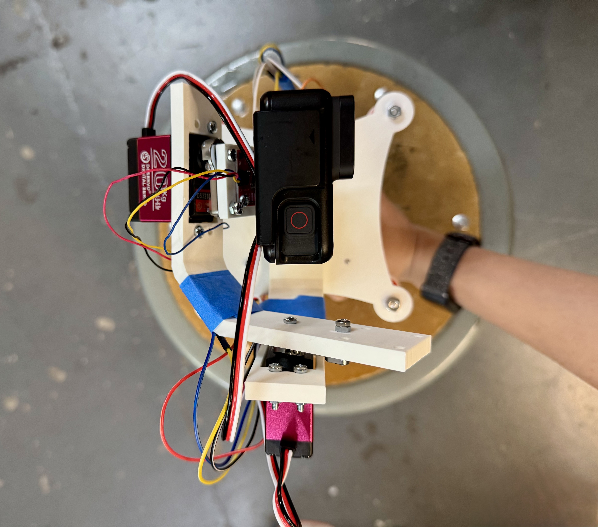
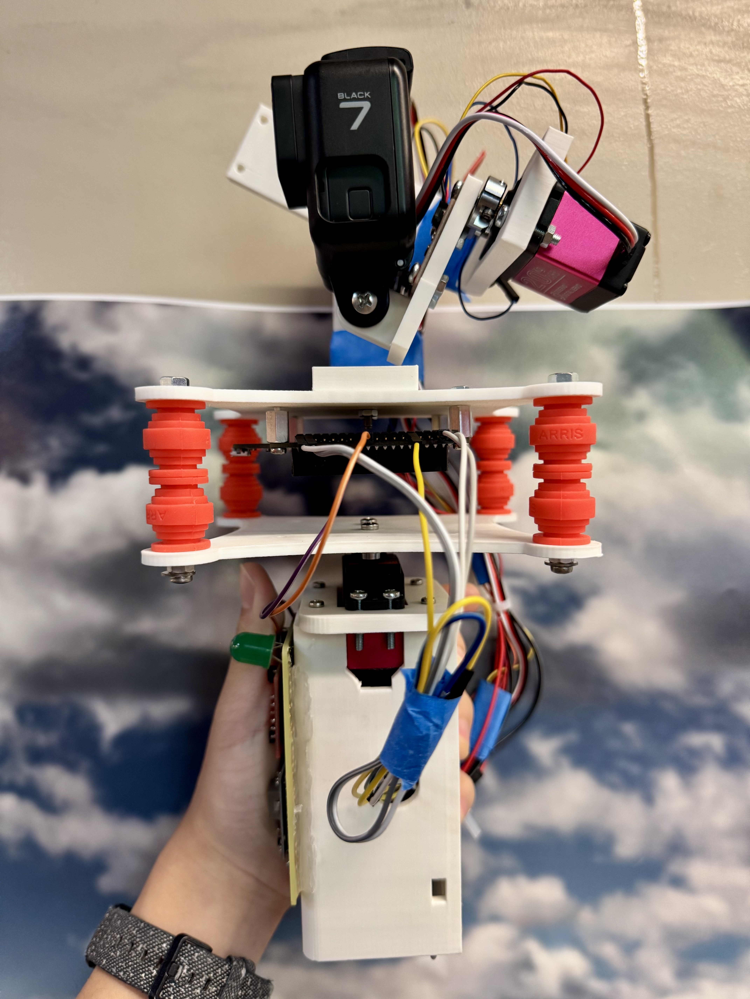
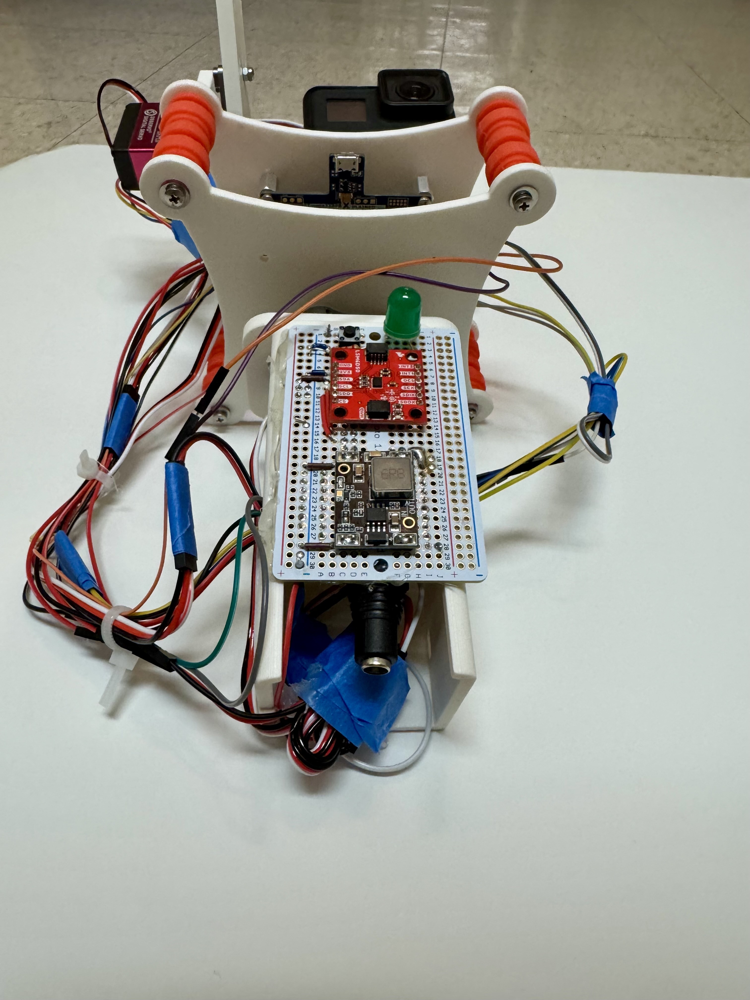
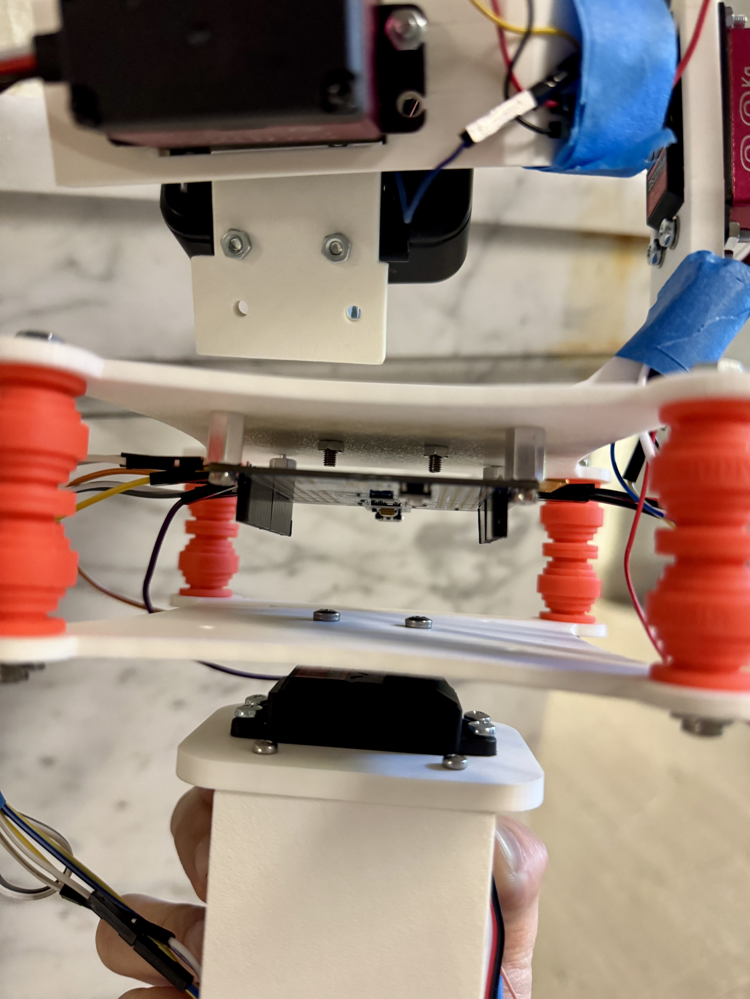
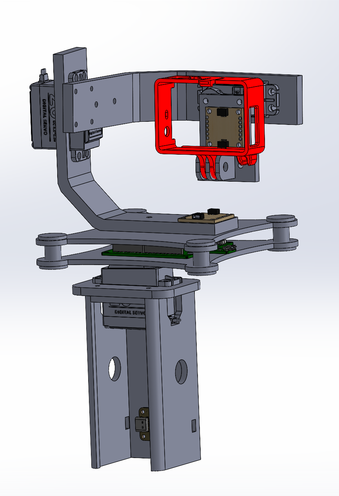
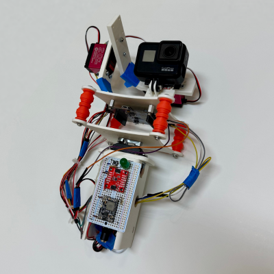

# Final Project

**Team Number:** 10

**Team Name:** Gimbalers

| Team Member Name | Email Address             |
| ---------------- | ------------------------- |
| Cindy Liu        | [cinl@seas.upenn.edu]     |
| Mike Song        | [chengyus@seas.upenn.edu] |
| Justin Yu        | [justinyu@seas.upenn.edu] |

**GitHub Repository URL:** https://github.com/upenn-embedded/final-project-s26-t10

**GitHub Pages Website URL:** https://upenn-embedded.github.io/final-project-s26-t10/

## Final Project Proposal

### 1. Abstract

This project is the design and implementation of a 3-axis camera gimbal system that uses servos to provide active stabalization for a camera. It uses an Inertial Measurement Unit (IMU) to monitor angular rotation as an input. Feedback is processed by an ATMega328PB. The microcontroller will output PWM signals, corrected by a PID control algorithm. Finally, the entire system will be powered by USB-C.

### 2. Motivation

Conventional camera gimbals are expensive, usually upwards of $200. Furthermore, they are usually designed specifically for industry grade cameras, leaving much to be desired for amateur videographers. This project gives an affordable option for those looking to try recording videos wth stabalization. By utilizing the widespread USB-C connector for power, this device can be used in many environments with a variety of power sources.

### 3. System Block Diagram

### 4. Design Sketches

### 5. Software Requirements Specification (SRS)

**5.1 Definitions, Abbreviations**

(IMU) - Inertial Measurement Device, gives linear acceleration and angular rate data
(Angular Rate) - degrees per second, as given by IMU
(PID controller) Proportional-Integral-Derivative controller. Uses feedback to hit a target while reducing overshoot, in this case to stabalize the axis after rotation. Uses integral and derivative of error to adjust output.
(PWM) - pulse width modulation, produces a square wave output from the microcontroller to serve as an input to the servo.

**5.2 Functionality**

| ID     | Description                                                                                                                                                                                                                            |
| ------ | -------------------------------------------------------------------------------------------------------------------------------------------------------------------------------------------------------------------------------------- |
| SRS-01 | The IMU 3-axis angular rate will be measured with 16-bit depth every 100 milliseconds $\pm$10 milliseconds.                                                                                                                            |
| SRS-02 | The PID controller will recieve new inputs and produce PWM outputs for each servo every 100 milliseconds $\pm$10 milliseconds, based on estimated error with an accumulator variable that sums IMU's angular rate every polling cycle. |
| SRS-03 | The PWM Duty cycle that is output to the servos will be updated every 100 milliseconds $\pm$10 milliseconds.                                                                                                                           |
| SRS-04 | The gimbal will read the input of an "enable" button so it will stop stabalizing if the button is pressed.                                                                                                                             |
| SRS-05 | The device can be reset to zeroed positions with the press of the "zero" button.                                                                                                                                                       |
| SRS-06 | The device can be manually zeroed and the position can then be remembered with a long press of the "zero" button.                                                                                                                      |
| SRS-07 | The user shall be able to determine the state of the device operation by viewing the status LED.                                                                                                                                       |

### 6. Hardware Requirements Specification (HRS)

**6.1 Definitions, Abbreviations**

MCU - Microcontroller Unit, compact integrated circuit that processes inputs and manages dedicated outputs and tasks.
Camera Plate - Platform for GoPro/similar sized camera to rest on, controlled on 3 axes by the servos.
Zeroing - Setting the default position for the camera plate, manually done by aligning the camera plate with the handle.

**6.2 Functionality**

| ID     | Description                                                                                     |
| ------ | ----------------------------------------------------------------------------------------------- |
| HRS-01 | USB-C PD module should deliver 20V output from an USB-C input.                                  |
| HRS-02 | Buck Converter Module should deliver stable 5V output.                                          |
| HRS-03 | ATmega328PB will function as the microcontroller for the device and also deliver 3.3V.          |
| HRS-04 | 2 IMUs interfaced via I2C will deliver acceleration and position data to the MCU.               |
| HRS-05 | 3 servos will control the pitch, roll, and yaw of the camera plate.                             |
| HRS-06 | Two buttons that allows users to enable the gimbal function and zero the servos.                |
| HRS-07 | Servos combined with IMU inputs stabilize movement of camera plate in three degrees of freedom. |
| HRS-08 | Servos combined with the IMU inputs can "lock" the camera onto a specific location/direction.   |

### 7. Bill of Materials (BOM)

https://docs.google.com/spreadsheets/d/1yj54xOVig_wChPn7wCOqRE96ZmyI3QeAy7MwsV0c4z8/edit?gid=2071228825#gid=2071228825

### 8. Final Demo Goals

Demonstrate a 3-axis (pitch and roll) active stabilization. Able to keep camera platform stable despite rapid movements. The system shall read angular velocity from an IMU, compute a stable angle estimate, and drive three servos. Independent PID controllers on each axis shall correct for angular error at 10Hz.

### 9. Sprint Planning

| Milestone  | Functionality Achieved                                                                                                                                                                               | Distribution of Work                                                                                                                                                                                                                     |
| ---------- | ---------------------------------------------------------------------------------------------------------------------------------------------------------------------------------------------------- | ---------------------------------------------------------------------------------------------------------------------------------------------------------------------------------------------------------------------------------------- |
| Sprint #1  | Using an I2C Library, stabilize pitch, create handle and first servo mount                                                                                                                           | Mike will CAD the handle and servo mount prototype. Justin and Cindy will implement and tune PID for one axis.                                                                                                                           |
| Sprint #2  | Move away from using I2C library, include second servo and begin tuning both axes in tandem, then moving on to include the third and last servo.                                                     | Mike will design and integrate the complete 3 servo mount and validate mechanical balance on all axes. Justin and Cindy will work on integration between the 3 axes and the PID loop.                                                    |
| MVP Demo   | All axes stabilizing with servo actuation. Complementary filter producing stable angle estimates on all axes. PID visibly rejecting hand-induced disturbances. Mechanical assembly fully integrated. | Mike ensures full mechanical assembly is complete and camera platform is balanced. Cindy integrates both PID loops and validates stable closed-loop behavior on pitch and roll. Justin validates I2C driver and verifies clean IMU data. |
| Final Demo | Custom I2C driver, complementary filter, PID controllers, all written from scratch in register-level C. System visibly stabilizes camera footage under moderate hand disturbance at 10Hz.            | Mike finalizes mechanical assembly, performs cable management, and captures demo footage. Justin and Cindy tunes PID gains on all axes, implements deadband, and optimizes control loop timing.                                          |

**This is the end of the Project Proposal section. The remaining sections will be filled out based on the milestone schedule.**

## Sprint Review #1

### Last week's progress

In the past week, we started working on both the mechanical structure of the gimbal and the software for the IMU reading and servo control. We were able to get a preliminary assembly in CAD of the mates for each axis of rotation, as well as model the servo motors and camera frame. On the software side, we were able to use I2C to read the angle from the IMU, compute servo correction position, and generate an output PWM to stablize the system. Finally, we have also placed the order for our remaining parts.

### Current state of project

Code file: see main.C

CAD:

Video of motor stabalization in response to IMU:

<video controls src="Images/Motor video sprint1.MOV" title="Title"></video>

Link to video: https://drive.google.com/file/d/1zUX_p3jPe_XTrYJxmcY68znGZ1ic0DGx/view?usp=drive_link

Being able to get the motor to smoothly respond to rotation in one axis is a major step and provides a solid foundation for building on top of that. We foresee a lot more challenges in integrating PID into a multi-axis system since the axis and position will affect one another, but our current state is enough to ensure at least minimum functionality.

### Next week's plan

Finish the CAD assembly and start 3D printing the parts at RPL. The CAD should take half a week and printing the parts may take longer, up to 1 week. (Mike)

Refine the algorithm for one-axis PID, and add in second IMU and servo. Expect to take up to 1.5 weeks. Start experimenting with power delivery with sample PD board from Detkin before actual power parts arrive, take around 1 week. (Justin and Cindy)

## Sprint Review #2

### Last week's progress

In the past week, we have made progress on both the mechanical assembly and the PID control. The parts of the assembly that were CADed last week have been 3d-printed such as the go-pro mount and its bracket, and we are testing to see if the parts fit. New parts were added to the CAD assembly, including the board mount and the handle. Some of our parts have also arrived, including a servo motor of our specified model that we used for testing the PID algorithm.

On the software side, we fine-tuned the kp parameter and dt of our PID control. Now the servo responds at a faster rate and the error between the IMU's rotation and the servo's rotation has been decreased. We then assembled the IMU, servo, and bracket together to create a 1-axis prototype.

### Current state of project

Code file: see main.C

CAD:

Video of 1-axis prototype:

<video controls src="Images/Demo Sprint 2.MOV" title="Title"></video>

Link to video: https://drive.google.com/file/d/1BJ6jZqnTRZo793Z51MHxtKvuvLm101JA/view?usp=drive_link

From the video, we see that the angle of the servo (where the go-pro camera mount will go) remains around the same angle relative to the ground.

### Next week's plan

Finalize the CAD, print all the parts, and build a full assembly. This will allow us to know which parts need to be remeasured and fixed for the final print. (Assigned to Cindy and Mike, finish by MVP demo day).
On the software side, the first goal is to integrate the other two servos so that we have a kp parameter tuned for three servos at once. (Assigned to Justin, finish by MVP demo day).
If time permits, we can start adding I and D elements into the code to decrease error and oscillation.

## MVP Demo

The plan for the system block diagram has not changed significantly since the project proposal. For our MVP, we have the I2C lines and PWM lines integrated. The MCU is able to communicate with sensors and actuators consistently, taking the data from the IMU and servos and implementing PID control.

Our device currently features two axis stabilization, as demonstrated by this video:

<video controls src="Images/MPV_video.MOV" title="Title"></video>

Link: https://drive.google.com/file/d/1pYFkpmA01hFtK_cwW8RbuCtw5umUj9uW/view?usp=sharing

The software implementation can be found in mvp.c on our gitHub. The software maintains a consistent sampling period (dt), in which it polls the IMU readings from. It then multiplies the rotation rate by dt to calculate the new angle. This angle is then used to calculate the error term (using KP paramter), the integral, and the derivative terms. Then, a PWM is sent to both servos to move the arms. Beyond the control algorithm, the rest of our software includes UART and I2C libraries, as well as gyro calibration and other setup functions. 

**For our project software requirements:**

We met/are close to meeting the following:

SRS-01: The IMU 3-axis angular rate will be measured with 16-bit depth every 100 milliseconds. Currently we are actively using only 2 of the angular rates.

SRS-02: The PID controller will receive new inputs and produce PWM outputs for each servo every 100ms, based on estimated error with an accumulator varaible that sums IMU's angualr rate every polling cycle. This has been achieved for our two servos.

SRS-03: The PWM duty cycle that is outputted to the servos will be updated every 100ms. This also been achieved for our two servos.

SRS-05: The device can be reset to zeroed positions with the press of the "zero" button. The reset feature is currently implemented in software; we still need to add a hardware button and input capture.

We still need to work on the following:

SRS-04: The gimbal will read the input of an "enable" button so it will stop stabailizing if the button is pressed.

SRS-06: The device can be manually zeroed and the position can then be remembered with a long press of the "zero" button.

SRS-07: The user shall be able to determine the state of the device operation by viewing the status LED.

Throughout testing, we collect data on angle, error, and servo ticks using the serial terminal, example below:

**For our project hardware requirements:**
We have met/are close to meeting the following:

HRS-03: ATmega328PB will function as the microcontroller for the device and also deliver 3.3V.

HRS-04: 2 IMUs interfaced via I2C will deliver acceleration and position data to the MCU.

HRS-05: 3 servos will control the pitch, roll, and yaw of the camera plate.

HRS-07: Servos combined with IMU inputs stabilize movement of camera plate in three degrees of freedom.

We still need to work on the following power-related hardware goals. Since the PD board has not arrived yet, we are powering the MVP through a power supply instead of a portable usb PD + buck converter.

HRS-01: USB-C PD module should deliver 20V output from an USB-C input.

HRS-02: Buck Converter Module should deliver stable 5V output.

We still need to work on the remaining UI related hardware goals:

HRS-06: Two buttons that allows users to enable the gimbal function and zero the servos.

HRS-08: Servos combined with the IMU inputs can "lock" the camera onto a specific location/direction.

Our plan moving forward before demo is:

1. Improve tuning of the first two servos and add the second IMU.
2. Mechanically assemble the base plates and handles
3. Add in the third servo and tune PID
4. Add in buttons for user reset and enable
5. Fix and clean up the wiring.
6. If time permits, implement the power module.

Thus, the remaining portions that will make our project complete include assembling the mechanical handle (which we already have the CAD for), programming the 3rd servo, implementing the buttons, and wiring the power distribution. 

The riskiest part remaining of our project is being able to achieve stabilization on all three axes with minimal jittering. Currently, we see a lot of jittering even with just two axes, and this poses the risk of damaging the mechanical assembly (we've had screws come lose from the jittering before). The risk is that after adding in the third axes, uncontrolled oscillations coming from all three servos would cause the entire device to not only be unstable, but also amplifier the error in our rotations. We plan to de-risk this by strengthening the mechanical assembly, re-tune the first two axes, and improve accuracy by adding in a second IMU.

## Final Report

### 1. Video
<video controls src="Validation/Final_Demo.mp4" title="Title"></video>
Drive link: https://drive.google.com/file/d/10acfHOuCoLdp05zlck74QHSjerl7qYwV/view?usp=sharing

### 2. Images
#### Top View

#### Side View

#### Side View 2

#### Side View Closeup

#### Solidworks Assembly

#### Website 400x400 Picture

### 3. Results

#### 3.1 Software Requirements Specification (SRS) Results

Overall, based on our quantified system performance, the majority of our software requirements were met. For some of the requirements associated with the refresh rate of the system, we were able to improve upon it and achieve more precise control. Otherwise, features that were deemed not necessary to critical function were not included such as a button to enable the entire machine. 

| ID     | Description                                                                                               | Validation Outcome                                                                          |
| ------ | --------------------------------------------------------------------------------------------------------- | ------------------------------------------------------------------------------------------- |
| SRS-01 | The IMU 3-axis acceleration will be measured with 16-bit depth every 100 milliseconds +/-10 milliseconds. | Confirmed, logged output from the MCU is saved to "validation" folder in GitHub repository.
| SRS-02 | The PID controller will recieve new inputs and produce PWM outputs for each servo every 100 milliseconds $\pm$10 milliseconds, based on estimated error with an accumulator variable that sums IMU's angular rate every polling cycle. | PID implemented but constants not optimized to work with all 3 axis.  
| SRS-03 | The PWM Duty cycle that is output to the servos will be updated every 100 milliseconds $\pm$10 milliseconds.                                                                                                                           | Confirmed, PWM commands are sent to the servo every 5 ms, exceeding the requirements. 
| SRS-04 | The gimbal will read the input of an "enable" button so it will stop stabalizing if the button is pressed.                                                                                                                             | Not implemented. 
| SRS-05 | The device can be reset to zeroed positions with the press of the "zero" button.                                                                                                                                                       | Confirmed, validated in final demo video. 
| SRS-06 | The device can be manually zeroed and the position can then be remembered with a long press of the "zero" button.                                                                                                                      | Confirmed, validated in final demo video, resetting in an alternate position sets the zero to that gyroscope position. 
| SRS-07 | The user shall be able to determine the state of the device operation by viewing the status LED.                                                                                                                                       | Confirmed, green light blink indicates that calibration is complete, and the gimbal is ready. 

#### 3.2 Hardware Requirements Specification (HRS) Results

Overall, based on our quantified system performance, we met the majority of our hardware goals. Due to circumstances with part availability (USB-C PD module out of stock and could not be delivered), we had to adapt and implement different fixes. For instance, instead of a USB-C input, a barrel jack input was used to emulate a similar setup. Otherwise, our primary goals were achieved and the gimbal performed its core functionality. 

| ID     | Description                                                                                                                        | Validation Outcome                                                                                                      |
| ------ | ---------------------------------------------------------------------------------------------------------------------------------- | ----------------------------------------------------------------------------------------------------------------------- |
| HRS-01 | USB-C PD module should deliver 20V output from an USB-C input. | Change of plan due to stock of USB-C PD module ordered. Barrel jack instead delivers 12V to the buck converter.
| HRS-02 | Buck Converter Module should deliver stable 5V output. | Confirmed, buck converter outputs 5V, multimeter screenshot in validation folder (Validation/Buck_5V_Output).
 | HRS-03 | ATmega328PB will function as the microcontroller for the device and also deliver 3.3V.  | Confirmed, ATmega328PB used for final product and powers the IMUs. 
| HRS-04 | 2 IMUs interfaced via I2C will deliver acceleration and position data to the MCU. | Confirmed, screenshot of IMU outputs included in validation folder (Validation/Terminal_Readings AXYZ and BXYZ readings). 
| HRS-05 | 3 servos will control the pitch, roll, and yaw of the camera plate.  | Confirmed, shown in final demo video where all 3 axis are able to move. 
| HRS-06 | Two buttons that allows users to enable the gimbal function and zero the servos.  | Determined that functionality to enable the gimbal was uncessary, confirm that servos can zero with button as shown in final demo video.
| HRS-07 | Servos combined with IMU inputs stabilize movement of camera plate in three degrees of freedom. | Confirmed, there is no overshooting or excessive oscillations when moving them gimbal in three axis.  
| HRS-08 | Servos combined with the IMU inputs can "lock" the camera onto a specific location/direction. | Confirmed, gimbal is able to keep pointing towards "zeroed" direction when moved in three axis. 

### 4. Conclusion

Overall, this project required the integration across many different areas including embedded systems, electrical systems, mechanical assembly, and controls. We learned how to work through an integrated project such as this from end-to-end and also how to walk through the different issues that arise from each stage. The general progression of the project went well as we were able to organize and achieve stages of functionality from each sprint review and week to week. We are proud that we were able to deliver a final project that worked and also solve many of the control challenges that came up as we tried adding more degrees of freedom. 

In terms of mechanical assembly, we learned how to incorporate different components such as servos more complicated 3D printed assemblies. In addition, we learned to work with wiring and ensuring to leave adequate room for wiring and accessability. For electrical, we learned to adapt to situations such as testing a barrel jack instead of the usb-c module, and integrating that with the system. Finally, we further refined our embedded knowledge in controlling different servos by PWM with the ATmega MCU. The controls also required different strategies such as calculating the error for our two IMUs using trig and also using feedforward to better optimize our control loop. 

We would have better timed the testing of mechanical assemblies if we could do anything differently, since this would have given us more time to plan for the wiring and where the electronics would be mounted. Some unexpected challenges came from the controls, where we did not have too much experience and thus did not know what to expected. However, we were able to consult online resources and work towards different fixes and creating a working product. As a next step for the project, we would properly incorporate PID for all 3 axes working together and also add more accessability features. 

## References
No additional libraries used. Public designs for 3D printed gimbals and platforms were references as inspiration and diverged from for our designs. 